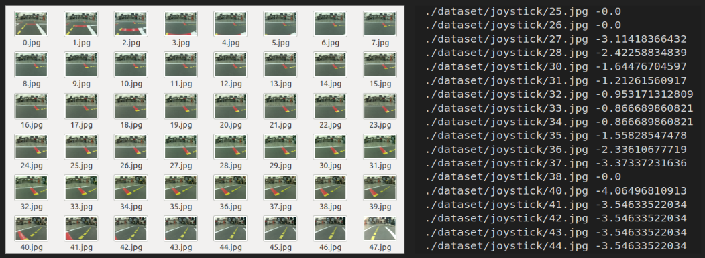
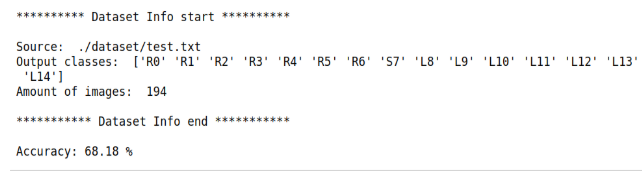

# AlexNet-pytorch
This repo is created for imitation learning Pytorch AlexNet which was a material of AI course in NCTU.  
People can use any robot with ROS to predict which is the direction to go next. (omega) 


# Dataset
```bash
/joy_mapper_node/car_cmd
/camera_node/image/compressed
``` 

Input = image, omega  
Output = 15 classes (['R0' 'R1' 'R2' 'R3' 'R4' 'R5' 'R6' 'S7' 'L8' 'L9' 'L10' 'L11' 'L12' 'L13' 'L14'])


## I. Prerequisite
 1. OS: Ubuntu 16.04/18.04
 2. GPU with Nvidia driver >= 384.xx (cuda10.0 or newer)
 3. [Docker](https://docs.docker.com/install/linux/docker-ce/ubuntu/)

## II. Test
```bash
$ cd AlexNet_pytorch
$ pip install -r requirements.txt
$ jupyter notebook 
```
1.  Download_dataset.ipynb     (Get the dataset)
2.  Download_models.ipynb      (Get the models)
3.  train-pytorch.ipynb        (To start training)
4.  evaluation-pytorch.ipynb   (To evaluate the models)


## III. Evaluation



## IV. Predict & Demo


# Connect to ROS
```bash
# RPi3 (duckietown)
$ cd robot-lane-following
$ source start_pi.sh   #joystick and camera

# On Jetson Nano
$ cd robot-lane-following
$ source docker_run_robot.sh
container$ cd nano_ws
container$ catkin_make
container$ source devel/setup.bash
container$ vim ~/.bashrc
# modify "ROS_IP=10.42.0.2" to "ROS_IP=$(hostname -I)"
container$ source  ~/.bashrc
container$ roslaunch imitation_following pytorch_joy_mapper_node.launch veh:=[car_hostname] model:=[model_name].pth
``` 
